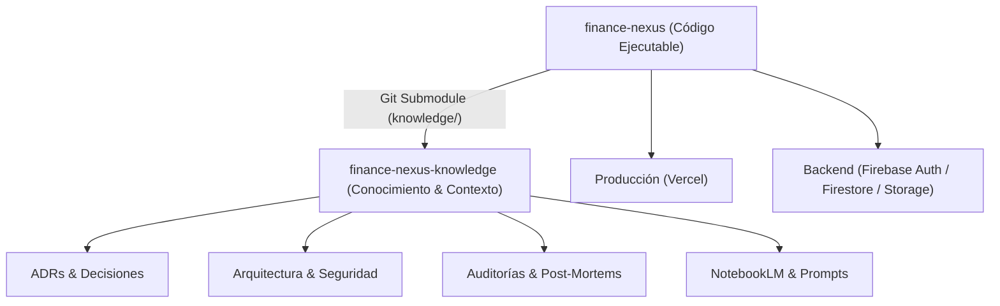

# 🧠 Finance Nexus — Contexto del Proyecto y Arquitectura Documental

Este documento sirve como **puerto de entrada y contexto unificado** para desarrolladores, colaboradores y agentes de Inteligencia Artificial que interactúen con el ecosistema de **Finance Nexus**.

---

## 🏛️ Arquitectura de Repositorios Separados (Código vs. Conocimiento)

El proyecto adopta un modelo de gobernanza desacoplado entre el código ejecutable y la base de conocimiento:



| Repositorio | Tipo | Propósito | Enlace |
|---|---|---|---|
| **`finance-nexus`** | Código ejecutable | Frontend React 19, Vite, Firebase, Recharts, despliegue Vercel | [Repositorio Principal](https://github.com/nexuslabsaihq-svg/finance-nexus) |
| **`finance-nexus-knowledge`** | Documentación y Contexto | Arquitectura, ADRs, seguridad, auditorías, modelo de datos, prompts | [Repositorio de Conocimiento](https://github.com/nexuslabsaihq-svg/finance-nexus-knowledge) |

El repositorio de conocimiento está integrado dentro de este repositorio como un **Git Submodule** ubicado en la carpeta:
👉 [`knowledge/`](knowledge/INDEX.md) (rama `main`).

---

## 🚀 Cómo Trabajar con el Repositorio y la Documentación

### 1. Clonación Completa (con Documentación Incluida)
Para clonar el proyecto principal junto con toda la base de conocimiento y contexto:
```bash
git clone --recurse-submodules https://github.com/nexuslabsaihq-svg/finance-nexus.git
cd finance-nexus
```

Si ya clonaste el proyecto sin submódulos:
```bash
git submodule update --init --recursive
```

### 2. Actualización de la Documentación
Para sincronizar y traer las últimas actualizaciones del repositorio de conocimiento:
```bash
git submodule update --remote knowledge
```

---

## 🗺️ Guía de Navegación Rápida al Conocimiento Clave

Toda la documentación detallada está organizada de forma taxonómica dentro del submodule [`knowledge/`](knowledge/INDEX.md):

* **Índice Central:** [`knowledge/INDEX.md`](knowledge/INDEX.md)
* **00 — Carta del Proyecto:**
  * [Visión y Propósito](knowledge/00-project-charter/vision.md)
  * [Alcance y Fronteras del Sistema](knowledge/00-project-charter/scope.md)
  * [Personas y Arquetipos de Usuario](knowledge/00-project-charter/personas.md)
  * [Glosario Terminológico Financiero y Técnico](knowledge/00-project-charter/glossary.md)
* **01 — Arquitectura Técnica:**
  * [Visión General del Sistema](knowledge/01-architecture/system-overview.md)
  * [Arquitectura Frontend (React 19 / Vite 8)](knowledge/01-architecture/frontend.md)
  * [Servicios e Infraestructura Firebase](knowledge/01-architecture/firebase.md)
  * [Arquitectura del Asistente IA](knowledge/01-architecture/ai-architecture.md)
  * [Pipeline y Estrategia de Despliegue (Vercel)](knowledge/01-architecture/deployment.md)
  * [Modelo de Datos Firestore](knowledge/01-architecture/data-model.md)
* **02 — Producto y UX:**
  * [Catálogo de Módulos Funcionales](knowledge/02-product/modules.md)
  * [Flujos Principales de Usuario](knowledge/02-product/user-flows.md)
  * [Flujo de Onboarding y Tour Interactivo](knowledge/02-product/onboarding.md)
  * [Decisiones de Diseño y Glassmorphism](knowledge/02-product/ux-decisions.md)
* **03 — Seguridad y Gobernanza:**
  * [Modelo de Autenticación y Ciclo de Sesión](knowledge/03-security/auth-model.md)
  * [Reglas de Seguridad Cloud Firestore](knowledge/03-security/firestore-rules.md)
  * [Reglas de Seguridad Firebase Cloud Storage](knowledge/03-security/storage-rules.md)
  * [Análisis de Seguridad y Privacidad BYOK](knowledge/03-security/byok-analysis.md)
  * [Modelo de Amenazas y Vectores de Riesgo](knowledge/03-security/threat-model.md)
  * [Plan de Respuesta a Incidentes](knowledge/03-security/incident-response.md)
* **05 — Registro de Decisiones de Arquitectura (ADRs):**
  * [ADR-0001: Separación de Repositorios (Código vs. Conocimiento)](knowledge/05-decisions/ADR-0001-repository-separation.md)
  * [ADR-0002: Adopción de Firebase como Backend-as-a-Service](knowledge/05-decisions/ADR-0002-firebase.md)
  * [ADR-0003: Selección de Google Gemini como Motor de IA](knowledge/05-decisions/ADR-0003-ai-provider.md)
  * [ADR-0004: Modelo BYOK (Bring Your Own Key) para IA](knowledge/05-decisions/ADR-0004-byok.md)
* **06 — Post-Mortems e Incidentes Resueltos:**
  * [Mutación de Arrays en Dashboard y Recharts](knowledge/06-incidents/dashboard-array-mutation.md)
  * [Resolución de Despliegues y Build en Vercel](knowledge/06-incidents/deployment-errors.md)
  * [Compatibilidad de Modelos Gemini y Fallbacks](knowledge/06-incidents/gemini-model-errors.md)
* **07 — Roadmap y Planificación:**
  * [Roadmap Estratégico (Now / Next / Later)](knowledge/07-roadmap/now-next-later.md)
  * [Plan de Hardening P0 de Seguridad](knowledge/07-roadmap/phase-p0-security.md)
  * [Historial de Versiones y Releases](knowledge/07-roadmap/releases.md)
* **08 — Prompts y Metaprompts:**
  * [System Prompt: CFO Virtual Especializado en Chile](knowledge/08-prompts/system-prompts/cfo-chile-prompt.md)
* **09 — Reportes y Auditorías Completas:**
  * [Auditorías Técnicas Fases 1 a 5](knowledge/09-generated-reports/audits/)

---

## 🔒 Reglas de Contribución para Agentes de IA y Desarrolladores

1. **Separación de Responsabilidades:** Nunca almacenar documentación extensa, análisis de negocio o actas de incidentes en este repositorio de código (`finance-nexus`). Todo el conocimiento debe documentarse en `finance-nexus-knowledge`.
2. **Higiene de Secretos:** Jamás commitear credenciales, API keys ni archivos `.env`. Las variables de entorno locales se rigen por `.gitignore`.
3. **Validación Previa a Commits:** Asegurarse de que `npm run build` y `npm run lint` pasen satisfactoriamente antes de enviar cambios a ramas protegidas.
