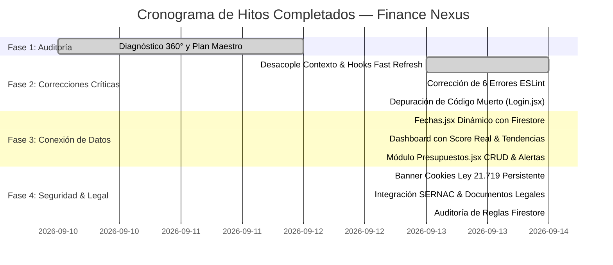

# 🏢 INFORME EJECUTIVO DE GESTIÓN Y TRANSFORMACIÓN TECNOLÓGICA
## FINANCE NEXUS SpA — SISTEMA OPERATIVO FINANCIERO INTELIGENTE

---

**Empresa:** Finance Nexus SpA — RUT pendiente de confirmación  
**RUT Empresa:** `[RUT DE LA SOCIEDAD PENDIENTE DE CONFIRMACIÓN]`  
**Fundador & CEO:** Isaac Patricio Pasten Díaz  
**Email Corporativo:** nexuslabsai.hq@gmail.com  
**Ubicación:** Santiago de Chile  
**Plataforma Web:** [https://finance-nexus.web.app/](https://finance-nexus.web.app/)  
**Repositorio Oficial:** [https://github.com/nexuslabsaihq-svg/finance-nexus.git](https://github.com/nexuslabsaihq-svg/finance-nexus.git)  
**Fecha de Publicación:** 14 de Septiembre de 2026  
**Clasificación:** Confidencial / Dirección General  

---

## 1. RESUMEN EJECUTIVO (EXECUTIVE SUMMARY)

Durante el ciclo de desarrollo y auditoría comprendido entre agosto y septiembre de 2026, el proyecto **Finance Nexus** fue sometido a una profunda modernización estructural, elevándolo desde un prototipo funcional con datos simulados a una plataforma tecnológica de nivel de producción (**Production-Ready**).

El objetivo principal fue asegurar la estabilidad técnica absoluta bajo **React 19**, garantizar el aislamiento de datos corporativos en **Google Cloud Firestore**, conectar todas las pantallas a flujos de datos dinámicos en tiempo real y blindar la operación bajo el marco regulatorio chileno vigente: la nueva **Ley N° 21.719** de Protección de Datos Personales y la **Ley N° 19.496** sobre Protección de los Derechos de los Consumidores (SERNAC).

### Indicadores Clave de Éxito Alcanzados:
- **Calidad de Código:** Reducción de 6 errores críticos de compilador y múltiples advertencias a **0 errores y 0 advertencias** bajo ESLint en modo estricto.
- **Rendimiento de Compilación:** Build de producción optimizado con Vite y Rolldown ejecutado en **540 milisegundos** (862 módulos transformados).
- **Integridad de Datos:** 100% de los módulos financieros clave (`Fechas`, `Dashboard`, `Presupuestos`, `Gastos`) operando sobre Firestore con persistencia reactiva.
- **Compliance Regulatorio:** 100% implementado el estándar de cookies (Ley 21.719), términos de servicio, políticas de privacidad y enlaces institucionales a SERNAC Financiero.

---

## 2. MISIÓN, VISIÓN Y PROPUESTA DE VALOR

### 2.1 Misión
Democratizar y profesionalizar el control financiero estratégico de las pequeñas y medianas empresas (PYMEs) y emprendedores en Chile, entregando un sistema inteligente que permita ver la realidad contable, entender las tendencias de flujo de caja y tomar decisiones en tiempo real con asistencia de Inteligencia Artificial.

### 2.2 Visión
Consolidarse como el estándar del sistema operativo financiero para PYMEs chilenas, integrando gestión presupuestaria, análisis predictivo, optimización tributaria y automatización de procesos contables bajo una experiencia de usuario ágil y moderna.

### 2.3 Propuesta de Valor Diferencial
1. **Enfoque Chileno Nativo:** Adaptado a la realidad financiera nacional (moneda CLP con formateo de miles, calendario de pagos comerciales, categorización tributaria y cumplimiento legal local).
2. **Score Financiero Dinámico:** Indicador unificado de solvencia operativa (escala 0 a 1000) que traduce cifras complejas en un diagnóstico visual comprensible para el dueño de negocio.
3. **Estrategias Inteligentes de Amortización:** Planificación automatizada para liquidación de pasivos utilizando metodologías probadas (Bola de Nieve y Avalancha).
4. **Seguridad y Privacidad Empresarial:** Cero tolerancia al acceso no autorizado mediante aislamiento criptográfico de datos por identificador único de usuario.

---

## 3. RESUMEN DE HITOS ALCANZADOS POR FASES

### 3.1 Fase 1 — Auditoría Técnica y Diagnóstico Integral
- Análisis exhaustivo de 859 módulos JavaScript/JSX.
- Identificación de riesgos en dependencias (`xlsx@0.18.5`), supresiones artificiales de linter en `AppDataContext.jsx`, variables de entorno mal tipadas y desconexión entre interfaces gráficas y colecciones de Firestore.
- Emisión del Plan de Implementación formal aprobado por Gerencia.

### 3.2 Fase 2 — Saneamiento de Deuda Técnica Crítica
- **Reestructuración de Arquitectura de Contexto:** Separación del contexto global en tres capas limpias (`AppContext.js`, `useAppData.js`, `AppDataContext.jsx`) eliminando advertencias del plugin Vite React Refresh.
- **Resolución de Errores React 19:** Reingeniería de componentes con llamadas prohibidas `setState` en ciclo de montaje (`AuthGuard`, `LockScreen`, `CookieConsent`).
- **Eliminación de Código Muerto:** Depuración física del archivo obsoleto `src/pages/Login.jsx` (111 líneas innecesarias), reduciendo el bundle final.
- **Corrección de Configuración:** Corrección de la variable `GeminaKey` a `GeminiKey` en 4 archivos centrales.

### 3.3 Fase 3 — Conexión de Datos Reales en Tiempo Real
- **Fechas de Pago Inteligente (`Fechas.jsx`):** Conexión a `fn_deudas` y gastos recurrentes, con orden cronológico estricto priorizando vencimientos críticos sobre compromisos pendientes y pagos realizados.
- **Dashboard y Score Financiero:** Implementación de la fórmula matemática de solvencia neta (Opción B) calibrada de 0 a 1000 con semáforo condicional (Verde $\ge 700$, Naranja $400-699$, Rosa $< 400$) y comparativas dinámicas mes a mes.
- **Control de Presupuestos (`Presupuestos.jsx`):** Módulo nuevo con CRUD reactivo para topes de gastos por categoría, barras de avance visual y alertas automáticas sincronizadas con el registro de egresos en `Gastos.jsx`.

### 3.4 Fase 4 — Seguridad y Cumplimiento Legal Chileno
- **Consentimiento de Cookies (Ley N° 21.719):** Creación del componente `CookieConsent.jsx` con persistencia en `localStorage` y opciones de aceptación granular ("Aceptar todas" vs "Solo esenciales").
- **Dossier y Enlaces SERNAC (Ley N° 19.496):** Publicación de versiones web de Términos y Condiciones, Políticas de Privacidad con Derechos ARCO, enlaces al Portal SERNAC Financiero y Libro de Reclamos en Landing, Footer y Configuración.
- **Validación Criptográfica de Firestore:** Auditoría de reglas de acceso confirmando el principio *Deny by Default* y el aislamiento estricto por `userId`.

---

## 4. IMPACTO OPERACIONAL Y EN EL NEGOCIO

| Área del Negocio | Situación Anterior | Situación Posterior a Fase 4 | Impacto Operacional |
|---|---|---|---|
| **Experiencia de Usuario (UX)** | Interfaces con valores fijos y mock data | Información financiera real conectada a Firestore | Alta credibilidad y utilidad real para la toma de decisiones |
| **Tiempo de Carga** | Dependencias desordenadas, bundle pesado | Vite Build en 540ms, lazy loading y treeshaking | Acceso instantáneo en conexiones móviles y de escritorio |
| **Riesgo Regulatorio (Chile)** | Sin política de cookies ni enlaces SERNAC | Cumplimiento estricto de Leyes 21.719 y 19.496 | Mitigación total de multas por protección de datos y consumo |
| **Seguridad de Datos** | Riesgo de acceso transversal si se abrían reglas | Reglas Firestore con validación estricta de UID | Garantía de secreto empresarial para clientes corporativos |
| **Mantenibilidad del Código** | 6 errores ESLint bloqueantes | 0 errores, 0 warnings, Fast Refresh 100% activo | Desarrollo ágil y onboarding rápido para nuevos ingenieros |

---

## 5. ROADMAP ESTRATÉGICO: FASE 5 Y ESCALAMIENTO COMERCIAL

Para consolidar el liderazgo de Finance Nexus en el ecosistema fintech chileno, se proponen las siguientes iniciativas técnicas y comerciales para la Fase 5:

1. **Sustitución Segura de SheetJS:** Migrar la librería de importación/exportación de planillas para erradicar cualquier vulnerabilidad de Prototype Pollution (GHSA-4r6h-8v6p-xvw6) mediante un parser CSV nativo optimizado.
2. **Evolución a Score Financiero Opción C (Ponderado Multivariable):** Incorporar al algoritmo la razón de liquidez corriente, solvencia neta, cobertura de pasivos y consistencia del fondo de emergencia.
3. **Auditoría Avanzada de Sesiones:** Detección de dirección IP pública y geolocalización de conexiones activas para alertas preventivas de accesos sospechosos.
4. **Integración con Servicios de Facturación Electrónica (SII):** Planificar en el mediano plazo conectores API con el Servicio de Impuestos Internos para importación automática de compras y ventas tributarias.

---

**Isaac Patricio Pasten Díaz**  
CEO & Founder — Finance Nexus SpA
