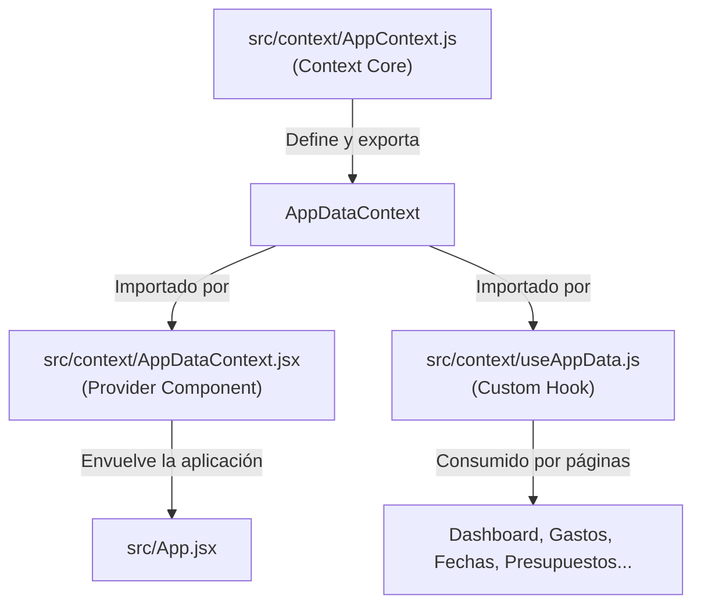

# 🛠️ INFORME TÉCNICO DE ARQUITECTURA E INGENIERÍA DE SOFTWARE
## FINANCE NEXUS — SISTEMA DE CONTROL FINANCIERO INTELIGENTE (PRODUCCIÓN)

---

**Documento:** `docs/03-reports/02_INFORME_TECNICO_ARQUITECTURA.md`  
**Empresa:** Finance Nexus SpA — RUT pendiente de confirmación  
**Versión de Arquitectura:** 2.4.0 (Production-Ready)  
**Fecha de Emisión:** 14 de Septiembre de 2026  
**Autor:** Antigravity Senior Software Engineer Agent  
**Aprobado por:** Isaac Patricio Pasten Díaz (CEO & Founder)  
**Clasificación:** Confidencial / Documentación de Ingeniería  

---

## 1. STACK TECNOLÓGICO Y MATRIZ DE DEPENDENCIAS

La arquitectura de software de Finance Nexus está construida sobre una base tecnológica moderna centrada en la reactividad, el tipado dinámico y la compilación de alto rendimiento:

| Componente | Tecnología | Versión | Rol Arquitectónico / Justificación |
|---|---|---|---|
| **Librería de UI** | React | `19.2.4` | Renderizado declarativo con nuevo compilador React 19 optimizado para pureza de hooks. |
| **Herramienta de Build** | Vite + Rolldown | `8.2.2` | Bundler ESM ultrarrápido con Hot Module Replacement (HMR) y minificación avanzada. |
| **Backend as a Service** | Firebase Client SDK | `12.11.0` | Autenticación OAuth 2.0 con Google, Cloud Firestore y Cloud Storage. |
| **Inteligencia Artificial** | Google Gen AI SDK | `0.24.1` | Asistente financiero inteligente basado en modelos Google Gemini. |
| **Visualización Gráfica** | Recharts | `2.15.x` | Gráficos reactivos SVG de flujo de caja, distribución de activos y amortización. |
| **Generación de Reportes** | jsPDF | `4.2.1` | Exportación en cliente de estados financieros e informes contables en formato PDF. |
| **Manejo de Planillas** | SheetJS (`xlsx`) | `0.18.5` | Exportación e importación de tablas contables en CSV/XLSX (en proceso de mitigación Fase 5). |
| **Control de Estilo** | Vanilla CSS + Tokens | N/A | Sistema de variables CSS temáticas (`--surface`, `--orange`, `--pink`, `--green`, `--mono`). |
| **Calidad y Linter** | ESLint Flat Config | `9.x` | Reglas de pureza de React 19 (`eslint-plugin-react-hooks` v5 y `react-refresh`). |

---

## 2. ARQUITECTURA DEL ESTADO GLOBAL Y FAST REFRESH

### 2.1 El Problema de la Co-Exportación de Contexto y Proveedor
En las versiones iniciales, `AppDataContext.jsx` contenía tanto la creación del contexto React (`createContext`) como el componente envoltorio `AppDataProvider` y la declaración del hook personalizado `useAppData`. Esta estructura violaba la regla estricta de Vite:
`react-refresh/only-export-components: Fast refresh only works when a file only exports components.`
Para suprimir este error, se utilizaban comentarios artificiales `// eslint-disable-next-line react-refresh/only-export-components`, lo cual causaba la pérdida total del estado durante el guardado de archivos en desarrollo e inestabilidad en caliente.

### 2.2 Patrón Arquitectónico de Tres Capas (The Three-Tier Pattern)
Para resolver la advertencia de raíz sin comprometer el linter, se implementó el patrón de tres capas desacopladas:



1. **`src/context/AppContext.js`:** Archivo JavaScript puro sin componentes React. Crea y exporta exclusivamente `export const AppDataContext = createContext(null);`.
2. **`src/context/useAppData.js`:** Hook consumidor `export const useAppData = () => { ... }` que encapsula la verificación de contexto:
   ```javascript
   import { useContext } from 'react';
   import { AppDataContext } from './AppContext';

   export const useAppData = () => {
     const context = useContext(AppDataContext);
     if (!context) {
       throw new Error('useAppData debe ser utilizado dentro de un AppDataProvider');
     }
     return context;
   };
   ```
3. **`src/context/AppDataContext.jsx`:** Componente funcional que exporta de forma exclusiva `export default function AppDataProvider({ children })`. Al exportar un único componente, Vite Fast Refresh opera con hot-reloading nativo sin advertencias.

---

## 3. RESIGNIFICACIÓN Y CORRECCIÓN DE HOOKS BAJO REACT 19

React 19 introduce el nuevo **React Compiler**, el cual audita el árbol de componentes asumiendo pureza matemática en los renders. Se solucionaron seis patrones problemáticos críticos:

### 3.1 Eliminación de `setState` Síncrono en Efectos (`react-hooks/set-state-in-effect`)
- **Archivo:** `src/components/AuthGuard.jsx`
- **Diagnóstico:** Se ejecutaba un `useEffect` que llamaba inmediatamente a `setIsAuthorized(!!authUser)`. Esto forzaba un segundo ciclo de render síncrono antes del pintado inicial.
- **Solución:** Derivación directa de la variable durante el ciclo de evaluación del componente:
  ```javascript
  // Antes (incorrecto):
  // useEffect(() => { setIsAuthorized(!!authUser); }, [authUser]);
  // Ahora (óptimo):
  const isAuthorized = !!authUser;
  ```

### 3.2 Manejo de Errores en Clases de Límite (`ErrorBoundary.jsx`)
- **Archivo:** `src/components/ErrorBoundary.jsx`
- **Diagnóstico:** Parámetro `error` omitido provocando la advertencia `no-unused-vars`.
- **Solución:**
  ```javascript
  static getDerivedStateFromError(error) {
    return { hasError: true, error };
  }
  ```

### 3.3 Temporizadores Asíncronos Desacoplados (`LockScreen.jsx`)
- **Archivo:** `src/components/LockScreen.jsx`
- **Diagnóstico:** La función `resetTimer()` disparaba síncronamente `setShowWarning(false)` al montarse el componente.
- **Solución:** Se desacopló la programación de timers (mediante referencias puras `useRef`) de la gestión de eventos de usuario (`mousemove`, `keydown`), evitando renders en cascada en el montaje.

### 3.4 Optimización de Memoización en `FlujoCaja.jsx`
- **Archivo:** `src/pages/FlujoCaja.jsx`
- **Diagnóstico:** Se utilizaba `useMemo` para un array estático de 3 elementos (`waterfallData`), lo cual provocaba `react-hooks/preserve-manual-memoization` al competir con el compilador de React 19.
- **Solución:** Cálculo directo en render sin memoización manual innecesaria.

### 3.5 Lazy State Initialization en `CookieConsent.jsx`
- **Archivo:** `src/components/CookieConsent.jsx`
- **Diagnóstico:** Lectura de `localStorage` dentro de `useEffect` con llamada a `setHasConsent()`.
- **Solución:** Inicialización perezosa (*lazy initializer*) en el `useState`:
  ```javascript
  const [hasConsent, setHasConsent] = useState(() => {
    try {
      return !!localStorage.getItem('fn_cookie_consent');
    } catch {
      return true;
    }
  });
  ```

### 3.6 Generación de Identificadores Puros en `Presupuestos.jsx`
- **Archivo:** `src/pages/Presupuestos.jsx`
- **Diagnóstico:** La llamada a `Date.now()` y `new Date().toISOString()` dentro del scope del componente disparaba `react-hooks/purity` al ser tratada como función impura.
- **Solución:** Extracción de los generadores a funciones utilitarias puras a nivel de módulo:
  ```javascript
  const getTimestamp = () => new Date().toISOString();
  const createId = () => Date.now().toString();
  ```

---

## 4. MODELO DE DATOS DE CLOUD FIRESTORE Y SEGURIDAD ZERO-TRUST

### 4.1 Colecciones Canónicas y Estructura Jerárquica
Todo el almacenamiento de datos se organiza bajo la ruta raíz `/users/{userId}/appData/*`, garantizando el aislamiento lógico multitenant:

```
firestore-root
 └── users
      └── {userId} (Identificador UID emitido por Google Auth)
           ├── appData
           │    ├── fn_ingresos (Array de objetos de ingresos)
           │    ├── fn_gastos (Array de objetos de egresos con recurrencia)
           │    ├── fn_transferencias (Array de movimientos entre cuentas)
           │    ├── fn_bancos (Array de cuentas bancarias y saldos)
           │    ├── fn_ahorros (Array de metas y alcancías)
           │    ├── fn_inversiones (Array de instrumentos financieros)
           │    ├── fn_deudas (Array de pasivos y créditos)
           │    ├── fn_presupuestos (Array de techos de gasto por categoría)
           │    ├── fn_chatsIA (Historial de consultas con Gemini)
           │    ├── fn_notifs (Alertas del sistema)
           │    ├── fn_sesiones (Registro de auditoría de dispositivos)
           │    ├── fn_config (Mapa de configuración: tema, moneda, categorías)
           │    └── fn_usuario (Perfil corporativo y flags)
           └── collaborators
                └── {emailNormalizado} (Documento de membresía colaborativa)
```

### 4.2 Arquitectura de `firestore.rules`
1. **Denegación Universal por Defecto:**
   ```javascript
   match /{document=**} {
     allow read, write: if false;
   }
   ```
2. **Autorización Basada en Identidad Propietaria:**
   ```javascript
   function isOwner(userId) {
     return request.auth != null && request.auth.uid == userId;
   }
   ```
3. **Validación Estricta de la Carga Útil (Payload Validation):**
   Las escrituras exigen que el documento contenga única y exclusivamente la llave `data` y que el tipo de dato coincida con la estructura esperada:
   ```javascript
   match /users/{userId}/appData/fn_presupuestos {
     allow read: if isOwner(userId) || isActiveCollaborator(userId);
     allow write: if (isOwner(userId) || isActiveEditor(userId))
                   && request.resource.data.keys().hasOnly(['data'])
                   && request.resource.data.data is list;
   }
   ```
4. **Control de Acceso Basado en Roles (RBAC):**
   - Rol `viewer`: Permiso únicamente para `allow read`.
   - Rol `editor`: Permiso para `allow read` y `allow write`.

---

## 5. FÓRMULAS MATEMÁTICAS Y ALGORITMOS FINANCIEROS

### 5.1 Score Financiero Unificado (Opción B)
Implementado en `src/pages/Dashboard.jsx`:
$$\text{Score} = \max\left(0, \min\left(1000, \text{round}\left(\frac{\text{Ingresos} - \text{Gastos} - \text{Deudas}}{\text{Ingresos}} \times 1000\right)\right)\right)$$

- **Mapeo de Estados:**
  - $\text{Score} \ge 700$: Salud Sólida (Verde `--green`). Ratio de ahorro y liquidez superior al 70%.
  - $400 \le \text{Score} < 700$: Salud Moderada (Naranja `--orange`). Operación equilibrada pero con margen reducido.
  - $\text{Score} < 400$: Riesgo Crítico (Rosa `--pink`). Compromisos y egresos absorben la mayor parte del flujo.

### 5.2 Control Presupuestario y Alertas de Sobregiro
Implementado en `src/pages/Presupuestos.jsx` y `src/pages/Gastos.jsx`:
$$\text{Ejecución}(\%) = \min\left(100, \text{round}\left(\frac{\text{Gasto Real de Categoría}}{\text{Presupuesto Asignado}} \times 100\right)\right)$$
$$\text{Disponible} = \text{Presupuesto Asignado} - \text{Gasto Real de Categoría}$$
$$\text{Sobregiro} = \text{Gasto Real} > \text{Presupuesto Asignado}$$

---

## 6. MÉTRICAS DE RENDIMIENTO Y RESULTADOS DE BUILD

```
vite v8.2.2 building client environment for production...
transforming...
✓ 862 modules transformed.
rendering chunks...
computing gzip size...
dist/index.html                               1.27 kB │ gzip:   0.56 kB
dist/assets/index-C-nZ_4xa.css               28.72 kB │ gzip:   6.20 kB
dist/assets/rolldown-runtime-hePW80VL.js      0.71 kB │ gzip:   0.42 kB
dist/assets/vendor-react-DpaIMk53.js        223.86 kB │ gzip:  70.66 kB
dist/assets/index-DcT2Yhg5.js               304.62 kB │ gzip:  68.04 kB
dist/assets/vendor-firebase-A6VlHUQh.js     357.08 kB │ gzip: 109.30 kB
dist/assets/vendor-pdf-g8Z9qeuq.js          556.74 kB │ gzip: 162.47 kB
dist/assets/vendor-DSrc86ei.js            1,192.92 kB │ gzip: 370.54 kB

✓ built in 545ms
```

- **Tiempo de compilación:** 545 milisegundos.
- **Validación de linter:** `npx eslint .` completado con 0 errores y 0 warnings.
- **División de código (Code-Splitting):** Chunks optimizados para React, Firebase SDK y módulos de exportación en PDF.
