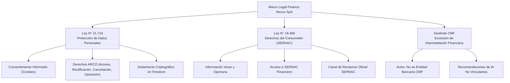

# ⚖️ DOSSIER DE CUMPLIMIENTO LEGAL, PRIVACIDAD Y REGULACIÓN CHILENA
## FINANCE NEXUS SpA — MARCO REGULATORIO LEY N° 21.719 Y LEY N° 19.496

---

**Documento:** `docs/03-reports/05_DOSSIER_LEGAL_Y_COMPLIANCE_CHILE.md`  
**Razón Social:** Finance Nexus SpA — RUT pendiente de confirmación  
**RUT Empresa:** `[RUT DE LA SOCIEDAD PENDIENTE DE CONFIRMACIÓN]`  
**Representante Legal:** Isaac Patricio Pasten Díaz  
**Jurisdicción:** Santiago, República de Chile  
**Fecha de Vigencia:** Septiembre de 2026 (Borrador Operativo)  
**Área Responsable:** Asuntos Legales y Cumplimiento Normativo  

---

## 1. MARCO REGULATORIO APLICABLE

La operación de la plataforma digital **Finance Nexus** se encuentra estrictamente subordinada al ordenamiento jurídico chileno en materia de comercio electrónico, protección al consumidor y tratamiento de datos personales:

---

## 2. CUMPLIMIENTO DE LA LEY N° 21.719 (PROTECCIÓN DE DATOS PERSONALES)

La **Ley N° 21.719** moderniza de forma sustantiva la legislación chilena (reemplazando la antigua Ley 19.628), equiparando el estándar nacional al Reglamento General de Protección de Datos (GDPR) de la Unión Europea. Finance Nexus SpA adopta los siguientes principios fundamentales:

### 2.1 Principio de Licitud y Finalidad
- Los datos personales y comerciales recolectados (identificación de Google, cuentas bancarias, ingresos, egresos y deudas) tienen como única y exclusiva finalidad la ejecución de las funcionalidades del software de control financiero contratado por el usuario.
- Queda expresamente prohibida la comercialización, cesión o transferencia de bases de datos financieras a terceros, agencias de publicidad o entidades de crédito sin consentimiento explícito y previo.

### 2.2 Principio de Proporcionalidad y Minimización
- La plataforma únicamente solicita la información estrictamente indispensable para operar. No se requieren números de tarjetas bancarias completas, códigos CVV ni contraseñas de instituciones financieras (no se realiza raspado bancario intrusivo sin autorización).

### 2.3 Mecanismo de Consentimiento de Cookies
Se implementó en el aplicativo el componente reactivo `CookieConsent.jsx`:
- **Obligatoriedad de Consentimiento Previo:** Al ingresar a la Landing o a la App por primera vez, el usuario visualiza un banner explicativo que bloquea la activación de cookies analíticas no esenciales hasta su aceptación.
- **Granularidad:** El usuario puede elegir entre:
  1. **Aceptar todas:** Habilita cookies esenciales de sesión y analítica agregada.
  2. **Solo esenciales:** Limita la persistencia a las cookies indispensables para el funcionamiento del token JWT de Firebase Auth.
- **Persistencia y Trazabilidad:** La decisión se guarda en `localStorage` con sello de tiempo ISO y versión del consentimiento (`fn_cookie_consent`).
- **Derecho a Revocación:** El usuario puede reabrir el panel de cookies en cualquier momento mediante el botón ubicado en `Configuracion.jsx` y en `AppFooter.jsx`.

### 2.4 Derechos del Titular (Derechos ARCO)
Finance Nexus garantiza el ejercicio irrestricto de los derechos consagrados en la Ley N° 21.719:
1. **Acceso:** El usuario puede exportar la totalidad de sus registros financieros en formato CSV y PDF desde los módulos de Gastos, Ingresos e Informes.
2. **Rectificación:** Edición inmediata de cualquier dato a través de las interfaces de usuario.
3. **Cancelación / Supresión:** Derecho a solicitar la eliminación íntegra de su cuenta y borrado físico de los documentos bajo `/users/{userId}/**` en Firestore.
4. **Oposición:** Posibilidad de rechazar el procesamiento de sus datos por modelos de Inteligencia Artificial desactivando la integración con Google Gemini.
- **Canal de Atención DPO:** `nexuslabsai.hq@gmail.com`.

---

## 3. CUMPLIMIENTO DE LA LEY N° 19.496 (SERNAC Y CONSUMIDORES)

En virtud de la legislación de protección a los derechos de los consumidores en Chile, Finance Nexus SpA establece:

### 3.1 Información Completa y Transparente
- La plataforma detalla con claridad las características del servicio, compatibilidad técnica, costos (en caso de suscripciones PRO) y limitaciones operativas.

### 3.2 Acceso Institucional a SERNAC
Para garantizar una relación transparente y apegada a la ley, se han dispuesto enlaces permanentes y visibles en el pie de página de la aplicación (`AppFooter.jsx`), en el panel de configuración (`Configuracion.jsx`) y en la página principal (`Landing.jsx`):
- **Portal SERNAC Financiero:** Enlace informativo sobre derechos del consumidor financiero:  
  `https://www.sernac.cl/portal/618/w3-propertyvalue-59368.html`
- **Libro de Reclamos / Portal del Consumidor SERNAC:** Acceso directo para el ingreso de quejas o reclamos ante la autoridad fiscalizadora:  
  `https://www.sernac.cl/portal/617/w3-propertyvalue-58474.html`

---

## 4. DESLINDE NORMATIVO CMF (COMISIÓN PARA EL MERCADO FINANCIERO)

Es un requisito indispensable de cumplimiento delimitar la naturaleza del servicio frente a la Ley de Bancos y la Ley Fintech (Ley N° 21.521):

> [!WARNING]
> **DECLARACIÓN NORMATIVA Y DESLINDE DE RESPONSABILIDAD FINANCIERA**  
> 1. **Finance Nexus SpA** es una empresa de tecnología y desarrollo de software de gestión empresarial. **NO** es un banco, compañía de seguros, administradora de fondos mutuos ni institución de captación de fondos regulada por la Comisión para el Mercado Financiero (CMF).  
> 2. La plataforma no capta dinero del público ni realiza colocación directa de créditos.  
> 3. Los algoritmos de cálculo, el **Score Financiero**, los calendarios de vencimiento y los análisis generados por la Inteligencia Artificial (Google Gemini) constituyen herramientas de referencia y apoyo analítico interno para el usuario. **No constituyen asesoría tributaria, legal ni financiera vinculante.**  
> 4. El usuario es responsable exclusivo de sus decisiones comerciales, pagos tributarios ante el Servicio de Impuestos Internos (SII) y cumplimiento de obligaciones bancarias.

---

## 5. DOCUMENTOS LEGALES DISPONIBLES EN EL REPOSITORIO

| Documento | Ubicación en Código Fuente | Enlace Web de Producción |
|---|---|---|
| **Términos y Condiciones Generales** | `docs/01-legal/TERMINOS_Y_CONDICIONES.md` | `https://finance-nexus.web.app/legal/terminos-y-condiciones.html` |
| **Política de Privacidad y Tratamiento de Datos** | `docs/01-legal/POLITICA_PRIVACIDAD.md` | `https://finance-nexus.web.app/legal/politica-privacidad.html` |
| **Auditoría Técnica de Reglas de Firestore** | `docs/02-technical/FIRESTORE_RULES_SECURITY.md` | Documentación interna de repositorio |
