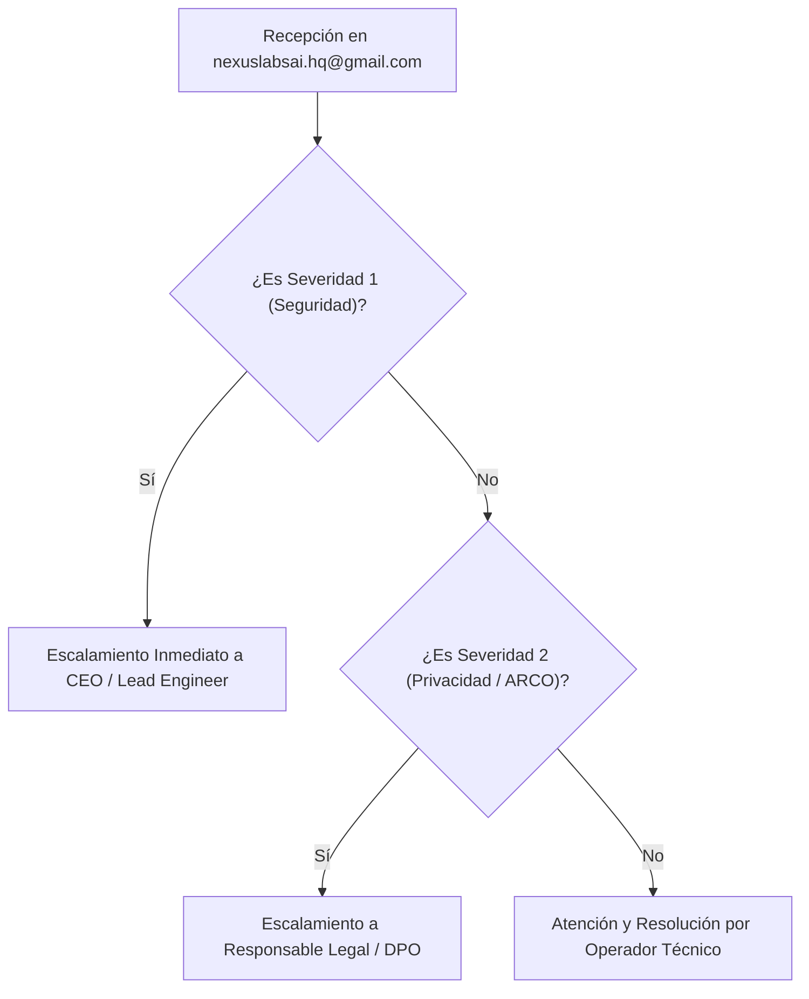

# ⏱️ MATRIZ DE NIVELES DE SERVICIO INTERNO (SLA)
## FINANCE NEXUS SpA — METAS DE TIEMPO DE RESPUESTA Y ESCALAMIENTO

---

**Documento:** `docs/04-operational/MATRIZ_SLA_SOPORTE.md`  
**Versión:** 1.0 (Política Interna Preliminar)  
**Fecha:** 14 de Septiembre de 2026  
**Responsable:** Isaac Patricio Pasten Díaz (Fundador & CEO)  
**Canal Centralizado:** `nexuslabsai.hq@gmail.com`  
**Horario Hábil de Operación:** Lunes a Viernes de 09:00 a 18:00 hrs (Horario de Chile Continental, GMT-3 / GMT-4)  

---

## 1. MATRIZ DE TIEMPOS OBJETIVO (SERVICE LEVEL AGREEMENT)

> [!NOTE]
> Los plazos indicados en esta matriz corresponden a **metas operativas internas de calidad de servicio** de Finance Nexus SpA para la fase MVP y no representan garantías legales vinculantes ni compromisos indemnizatorios.

| Nivel de Severidad | Tipos de Solicitud Comprendidos | Tiempo Máximo de Primer Acuse de Recibo | Tiempo Objetivo de Diagnóstico | Tiempo Objetivo de Resolución Final |
|---|---|---|---|---|
| 🔴 **Severidad 1 (Crítica)** | Incidente de seguridad, sospecha de fuga de datos, caída total del servicio en hosting. | $\le$ 2 horas hábiles | $\le$ 6 horas hábiles | $\le$ 24 horas hábiles |
| 🟠 **Severidad 2 (Alta)** | Solicitud de ejercicio de derechos ARCO (Ley 21.719), fallas en cálculo del Score Financiero o guardado en Firestore. | $\le$ 4 horas hábiles | $\le$ 12 horas hábiles | $\le$ 48 horas hábiles |
| 🟡 **Severidad 3 (Media)** | Problemas de visualización en navegadores específicos, dudas de categorización, errores cosméticos de UI. | $\le$ 8 horas hábiles | $\le$ 24 horas hábiles | $\le$ 72 horas hábiles |
| 🟢 **Severidad 4 (Baja)** | Sugerencias de nuevas funcionalidades, mejoras a la IA de Gemini, consultas comerciales generales. | $\le$ 12 horas hábiles | $\le$ 48 horas hábiles | $\le$ 5 días hábiles |

---

## 2. MATRIZ DE ESCALAMIENTO OPERACIONAL

### Protocolo de Contingencia (Severidad 1):
1. Detección o notificación de incidente de seguridad.
2. Contención inmediata: Revocación de sesiones en Firebase Auth o cambio de reglas de Firestore si hay brecha identificada.
3. Notificación a los usuarios afectados conforme al estándar del art. 33 de la Ley N° 21.719.
4. Emisión de informe post-mortem con plan correctivo en menos de 72 horas.
