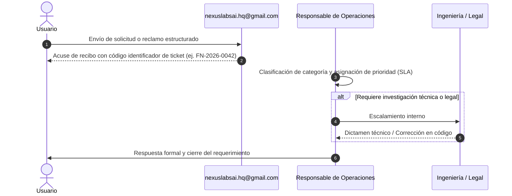

# 🛎️ PROCEDIMIENTO INTERNO DE ATENCIÓN DE SOPORTE Y RECLAMOS
## FINANCE NEXUS SpA — CANAL DE GESTIÓN AL USUARIO Y RESOLUCIÓN DE CONTROVERSIAS

---

**Documento:** `docs/04-operational/PROCEDIMIENTO_SOPORTE_Y_RECLAMOS.md`  
**Versión:** 1.0 (Borrador Operativo Interno)  
**Fecha:** 14 de Septiembre de 2026  
**Responsable de Operaciones:** Isaac Patricio Pasten Díaz (Fundador & CEO)  
**Canal Oficial Centralizado:** `nexuslabsai.hq@gmail.com`  

---

## 1. PRINCIPIOS GENERALES Y PROPÓSITO

El presente procedimiento establece el flujo estandarizado para la recepción, tipificación, investigación y respuesta de requerimientos de soporte técnico, consultas de facturación, solicitudes de privacidad (derechos ARCO) y reclamos formales presentados por los usuarios de la plataforma **Finance Nexus**.

Este canal opera como el **mecanismo de resolución directa de la empresa**, evitando que discrepancias operacionales menores escalen a instancias externas como el SERNAC o tribunales de justicia.

---

## 2. CATEGORÍAS DE TIPIFICACIÓN DE SOLICITUDES

Toda comunicación recibida en `nexuslabsai.hq@gmail.com` debe ser catalogada en una de las siguientes seis categorías:

| Código | Categoría | Descripción / Ejemplos | Prioridad Sugerida |
|---|---|---|---|
| **ST-01** | **Soporte Técnico** | Fallas de carga, errores de renderizado en React, problemas al guardar gastos o fechas en Firestore. | Media |
| **CO-02** | **Cobro y Facturación** | Consultas sobre planes Pro/Enterprise, comprobantes de pago, solicitud de reversas. | Alta |
| **CA-03** | **Cancelación de Cuenta** | Solicitud de cierre de cuenta, desconexión de colaboradores, rescisión del servicio. | Alta |
| **PR-04** | **Privacidad y Derechos ARCO** | Solicitud de acceso, rectificación, supresión o portabilidad de datos personales (Ley 21.719). | Crítica |
| **IS-05** | **Incidente de Seguridad** | Denuncia de sospecha de vulnerabilidad, accesos no reconocidos, fallas en AuthGuard. | Inmediata / Urgente |
| **SU-06** | **Sugerencias y Mejoras** | Propuestas de nuevas funciones contables, reportes, mejoras en la IA de Gemini. | Baja |

---

## 3. FORMATO DE CORREO ESTRUCTURADO (PLANTILLA DE ENVÍO)

Para optimizar el tiempo de respuesta, se solicita a los usuarios que sus comunicaciones incluyan la siguiente estructura básica:

```
Asunto: [CATEGORÍA] - [Breve descripción del caso] - [Correo de usuario]

Cuerpo del Mensaje:
1. Nombre completo / Empresa:
2. Correo de la cuenta en Finance Nexus:
3. Tipo de requerimiento: [Soporte / Cobro / Cancelación / Privacidad / Seguridad / Sugerencia]
4. Descripción detallada del problema o solicitud:
5. Pasos para reproducir el error (si aplica):
6. Captura de pantalla o comprobante adjunto (opcional):
```

---

## 4. FLUJO OPERACIONAL DE ATENCIÓN (PASO A PASO)



### Paso 1: Recepción y Asignación de Identificador (Ticket)
Dentro de las primeras **4 horas hábiles**, el operador genera una respuesta de confirmación asignando un código de ticket con el formato `FN-YYYY-XXXX` (ejemplo: `FN-2026-0001`).

### Paso 2: Análisis e Investigación
El equipo contrasta la solicitud contra los registros de Firestore (`fn_logs`, `fn_sesiones` o la colección afectada) sin exponer datos personales sensibles a terceros.

### Paso 3: Resolución y Cierre
Se remite una respuesta motivada y clara al correo del remitente con la solución aplicada, plazo de efectividad o instrucciones de desbloqueo.

---

## 5. REGISTRO CONFIDENCIAL DE RECLAMOS

Para cumplir con la auditoría interna sin infringir la Ley N° 21.719:
- Se mantiene un archivo interno `REGISTRO_RECLAMOS_CONFIDENCIAL.csv` en almacenamiento seguro cifrado.
- Se registran únicamente: Número de Ticket, Fecha, Categoría, Estado (Abierto / En Proceso / Resuelto), Tiempo de Resolución y Calificación del Usuario.
- **Se excluyen contraseñas, tokens JWT, montos específicos o balances bancarios.**
