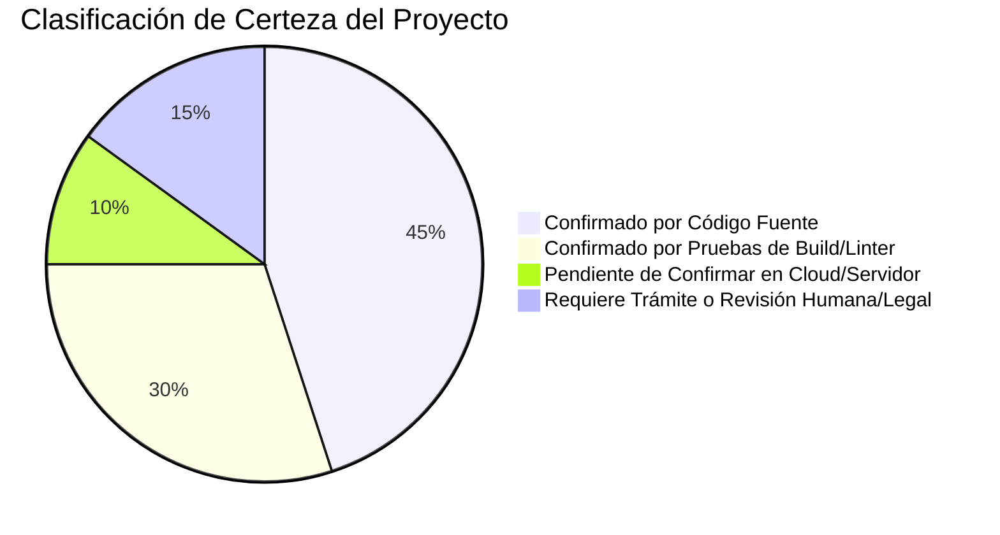

# 🏛️ AUDITORÍA MAESTRA Y BACKLOG ESTRATÉGICO CONSOLIDADO
## FINANCE NEXUS SpA — ESTADO DE SITUACIÓN Y CLASIFICACIÓN RIGUROSA DE EVIDENCIAS

---

**Documento:** `docs/MASTER_AUDIT_AND_BACKLOG.md`  
**Versión:** 1.0 (Auditoría Exhaustiva Fase 5A)  
**Fecha:** 14 de Septiembre de 2026  
**Auditor Responsable:** Antigravity Senior Software Engineer Agent  
**Aprobado por:** Isaac Patricio Pasten Díaz (Fundador & CEO)  
**Clasificación de Riesgo:** Gobernanza y Preparación Operacional  

---

## 1. TABLA MAESTRA DE AUDITORÍA POR ÁREAS

Esta matriz consolida la totalidad de componentes de la plataforma, separando de manera transparente y verificable la evidencia técnica empírica de aquellos aspectos pendientes de gestión humana:

| Área | Estado Actual | Evidencia | Riesgo | Prioridad | Acción Inmediata | Responsable |
|---|---|---|---|---|---|---|
| **Código y Arquitectura** | 🟢 **Estable (0 errores)** | `eslint .` (0 errores, 0 warnings), Vite build en 533ms (862 módulos). | Bajo | Media | Mantener arquitectura de tres capas (`AppContext`, `useAppData`, `Provider`). | Dev Lead |
| **Seguridad Cloud** | 🟢 **Zero-Trust en Repo** | `firestore.rules` con `Deny by default`, aislamiento por `userId` y RBAC. | Bajo | Alta | Programar tests de emulador en CI/CD antes del primer deploy a producción. | DevOps / Dev |
| **Datos y Firestore** | 🟢 **100% Dinámico** | Colecciones `fn_deudas`, `fn_gastos`, `fn_presupuestos` sincronizadas en vivo. | Bajo | Media | Auditar políticas de cuotas de lectura/escritura en Firebase Console. | Dev Lead |
| **Identidad Corporativa** | 🟡 **Pendiente Trámite** | Denominación `Finance Nexus SpA — RUT pendiente de confirmación` en footers y docs. | Medio | **Crítica** | Tramitar y obtener Cédula RUT electrónica de la sociedad ante el SII. | Isaac Pasten (CEO) |
| **Legal / Contratos** | 🟡 **Borradores v1.0** | Términos y Privacidad en Markdown y HTML con banner de borrador visible. | Medio | Alta | Someter borradores a visación por abogado colegiado en Chile. | Asesor Legal / Isaac |
| **Cookies y Privacidad** | 🟢 **Consentimiento Local** | `CookieConsent.jsx` persistente en `localStorage` (`fn_cookie_consent`). | Bajo | Media | Mantener ausencia total de píxeles publicitarios y trackers externos. | Dev Lead |
| **Soporte y SERNAC** | 🟢 **Canal Definido** | Correo `nexuslabsai.hq@gmail.com` integrado con SLA interno y enlaces SERNAC ext. | Bajo | Media | Establecer monitoreo diario del buzón de soporte. | Operaciones |
| **Dependencias (XLSX)** | 🟡 **Vulnerable Auditado** | `xlsx@0.18.5` documentado con propuesta de mitigación nativa lista para aprobar. | Medio | Alta | Evaluar y aprobar `PROPUESTA_MITIGACION_SHEETJS.md` para Fase 5B. | Isaac Pasten (CEO) |
| **UX y Accesibilidad** | 🟢 **Optimizado** | Diseño responsive, contraste dark mode, semáforos condicionales en presupuestos. | Bajo | Baja | Ajustar contrastes en pantallas secundarias (Documentos IA). | UI Designer |
| **Despliegue a Producción** | 🛑 **En Pausa Preventiva** | Prohibición explícita de `firebase deploy` hasta cierre de validaciones legales. | Nulo | Control | Mantener congelamiento de despliegue hasta autorización expresa. | CEO / DevOps |

---

## 2. SEPARACIÓN ESTRICTA DE CERTEZAS Y PENDIENTES

### 2.1 Confirmado por Código Fuente:
- [x] Desacoplamiento tripartito para Fast Refresh (`AppContext.js`, `useAppData.js`, `AppDataContext.jsx`).
- [x] Eliminación de `setState` síncrono en montaje (`AuthGuard.jsx`, `LockScreen.jsx`, `CookieConsent.jsx`).
- [x] Captura de errores en `ErrorBoundary.jsx`.
- [x] Eliminación física de 111 líneas de código muerto (`Login.jsx`).
- [x] Corrección de variables de entorno (`GeminiKey`).
- [x] Algoritmo matemático del Score Financiero (Opción B: 0 a 1000).
- [x] Módulo CRUD reactivo de presupuestos con semáforo de sobregiro (`Presupuestos.jsx`).
- [x] Calendario cronológico de pagos con priorización de deudas vencidas (`Fechas.jsx`).
- [x] Banner de cookies con lazy state y canal de soporte por correo.
- [x] Erradicación de `21.133.651-k` atribuido a la persona jurídica en código y web.

### 2.2 Confirmado por Pruebas Automatizadas de Build / Linter:
- [x] `npx eslint .`: 0 errores y 0 advertencias en modo estricto.
- [x] `npm run build`: Compilación exitosa en 533ms (862 módulos).
- [x] Ausencia de referencias rotas en imports y exports.

### 2.3 Pendiente de Confirmar en Servidor / Cloud:
- [ ] Verificación de paridad entre las reglas locales de `firestore.rules` y las reglas en Firebase Console.
- [ ] Ejecución de la suite automatizada con Firebase Emulator Suite (`PLAN_PRUEBAS_FIREBASE_SECURITY.md`).
- [ ] Cuotas de facturación y límites en Google Cloud Platform.

### 2.4 Requiere Trámite o Revisión Humana / Legal (Fuera del Código):
- [ ] Obtención formal del RUT de la SpA ante el Servicio de Impuestos Internos (SII).
- [ ] Descarga y archivo de Estatutos Sociales y Certificado de Vigencia del Registro de Empresas.
- [ ] Inscripción y certificación de Facturación Electrónica en sii.cl.
- [ ] Pago o tramitación de Patente Municipal comercial.
- [ ] Revisión y visación de los borradores legales por un abogado colegiado en Chile.
- [ ] Tramitación del registro de marca "Finance Nexus" ante INAPI.

---

## 3. BACKLOG PRIORIZADO PARA FASE 5B (POST-APROBACIÓN)

1. **Sprint 5B.1 — Mitigación SheetJS:** Implementar el módulo nativo `exportToCsv.js` y sanitizar la entrada de archivos en IA según `PROPUESTA_MITIGACION_SHEETJS.md`.
2. **Sprint 5B.2 — Sesiones y Auditoría:** Implementar cierre de sesiones activas en el perfil de usuario sin recolectar IP pública ni geolocalización.
3. **Sprint 5B.3 — Tests de Seguridad Automatizados:** Montar suite de pruebas para Firestore Emulator.
4. **Sprint 5B.4 — Formalización Legal:** Reemplazar denominación provisional una vez emitido el RUT definitivo de la SpA.
